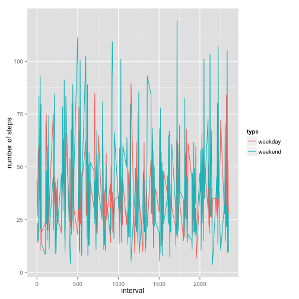

Activity data analysis
========================================================
* Loading and preprocessing the data
read the data set.

```r
activity <- read.csv(unz("RepData_PeerAssessment1//activity.zip", "activity.csv"), 
    header = T)
# dim(activity) head(activity)
```

* what is mean total number of steps taken per day?

draw the histogram of total steps taken of each day

```r
stepsOfEachDay <- as.data.frame(sapply(split(activity$steps, activity$date), 
    sum))
names(stepsOfEachDay) <- "steps"
hist(stepsOfEachDay$steps, xlab = "total steps of day")
```

 


the mean of total number of steps taken per day

```r
mean(stepsOfEachDay$steps, na.rm = TRUE)
```

```
## [1] 10766
```


the median of total number of steps taken per day

```r
median(stepsOfEachDay$steps, na.rm = TRUE)
```

```
## [1] 10765
```


* What is the average daily activity partten?
summerize the activity according to the time interval

```r
stepOfEachInterval <- as.data.frame(sapply(split(activity$steps, activity$interval), 
    mean, na.rm = TRUE))
names(stepOfEachInterval) <- "steps"
head(stepOfEachInterval)
```

```
##      steps
## 0  1.71698
## 5  0.33962
## 10 0.13208
## 15 0.15094
## 20 0.07547
## 25 2.09434
```

```r
plot(stepOfEachInterval$steps, type = "l", ylab = "average steps", xlab = "intervals", 
    main = "average steps at each interval")
```

 

find out which interval contains the maximum number of steps

```r
stepOfEachInterval$interval <- as.numeric(as.character(rownames(stepOfEachInterval)))
thisInterval <- which.max(stepOfEachInterval$steps)
### the maximum number of steps
stepOfEachInterval$steps[thisInterval]
```

```
## [1] 206.2
```

```r
### this interval has the maximum number of steps
stepOfEachInterval$interval[thisInterval]
```

```
## [1] 835
```


* imputing missing values
calculate the number of NA

```r
numberOfNA <- is.na(activity$steps)
table(numberOfNA)
```

```
## numberOfNA
## FALSE  TRUE 
## 15264  2304
```


filling in the missing value with the average steps at this interval

```r
### make copy of the activity
activityModified <- activity
### merge the two data sets according to interval column
activityM <- merge(activityModified, stepOfEachInterval, by = "interval", suffixes = c(".activityModified", 
    ".stepOfEachInterval"))

### substitute the NA in the activityModified data set according to activityM
activityModified$steps = ifelse(is.na(activityM$steps.activityModified), activityM$steps.stepOfEachInterval, 
    activityM$steps.activityModified)

head(activityModified)
```

```
##   steps       date interval
## 1 1.717 2012-10-01        0
## 2 0.000 2012-10-01        5
## 3 0.000 2012-10-01       10
## 4 0.000 2012-10-01       15
## 5 0.000 2012-10-01       20
## 6 0.000 2012-10-01       25
```

draw the histogram of total steps taken of each day

```r
stepsOfEachDayModified <- as.data.frame(sapply(split(activityModified$steps, 
    activityModified$date), sum))
names(stepsOfEachDayModified) <- "steps"
hist(stepsOfEachDayModified$steps)
```

 


the mean of total number of steps taken per day for modified activity

```r
mean(activityModified$steps)
```

```
## [1] 37.38
```


the median of total number of steps taken per day for modified activity

```r
median(activityModified$steps)
```

```
## [1] 0
```

average number of steps is much smaller than before after filling in the missing value with the average, therefore there is no effect.

* Are there difference in activity patterns between weekday and weekends?

```r
activityModified$date <- as.Date(activityModified$date)
activityModified$day <- weekdays(activityModified$date)
head(activityModified)
```

```
##   steps       date interval    day
## 1 1.717 2012-10-01        0 Monday
## 2 0.000 2012-10-01        5 Monday
## 3 0.000 2012-10-01       10 Monday
## 4 0.000 2012-10-01       15 Monday
## 5 0.000 2012-10-01       20 Monday
## 6 0.000 2012-10-01       25 Monday
```

```r
activityModified$type <- ifelse((activityModified$day == "Sunday") | (activityModified$day == 
    "Saturday"), "weekend", "weekday")  ### convert day to weekend and weekday 
```


```r
library(ggplot2)
### split data to weekday and weekend
activityweekday <- subset(activityModified, type == "weekday")
activityweekend <- subset(activityModified, type == "weekend")
### calculate the weekday average steps cross all weekdays for each interval
weekdayMeanStep <- as.data.frame(sapply(split(activityweekday$steps, activityweekday$interval), 
    mean))
colnames(weekdayMeanStep) <- "steps"
nrow(weekdayMeanStep)
```

```
## [1] 288
```

```r
weekdayMeanStep$type <- rep("weekday", 288)
weekdayMeanStep$interval <- as.numeric(as.character(rownames(weekdayMeanStep)))

### calculate the weekend average steps cross weekends for each interval
weekendMeanStep <- as.data.frame(sapply(split(activityweekend$steps, activityweekend$interval), 
    mean))
colnames(weekendMeanStep) <- "steps"
nrow(weekendMeanStep)
```

```
## [1] 288
```

```r
weekendMeanStep$type <- rep("weekend", 288)
weekendMeanStep$interval <- as.numeric(as.character(rownames(weekendMeanStep)))

### rbind weekday and weekend data
meanStepCombined <- rbind(weekdayMeanStep, weekendMeanStep)
# dim(meanStepCombined) class(meanStepCombined) head(meanStepCombined)
# tail(meanStepCombined)

### graph data
p <- ggplot(meanStepCombined, aes(x = interval, y = steps, group = type))
p + geom_line(aes(group = type, color = type)) + ylab("number of steps")
```

 

